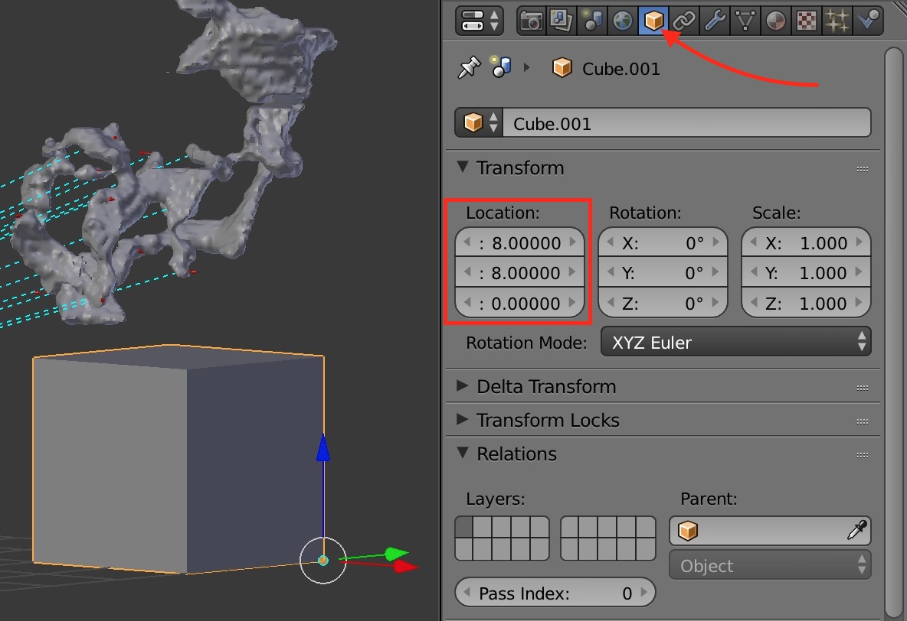

# Neuron Visualizations

This repo contains a some scripts, sample data and explanations on how to visualize data for connectomics research in Blender and Mayavi.

This is by no means an exhaustive tutorial, but rather more like a helloworld with some examples that might help you get started.

# Blender

Blender is a very powerful open source 3D modeling and animation software. It has hunderds of features for a variety of applications. Here we'll be using a tiny fraction of those features to jointly view neurons in the form of meshes and synaptic pair locations shown as arrows. We'll also be using the Blender addon [NeuroMorph](https://neuromorph.epfl.ch/).

## Installation
1. [Install Blender](https://www.blender.org/download/)
2. [Install NeuroMorph Toolbox](https://github.com/NeuroMorph-EPFL/NeuroMorph)
3. Activate the Neuromorph Add Ons 

## Importing Data
1. Use the neuromorph Add On to import a neuron. [(Tutorial)](https://www.youtube.com/watch?v=CVkcYjWgceM)
Be careful about the scaling option right above the import button. For the .obj sample neuron meshes provided here you need to use a scaling of 0.001.
2. If you follows these steps and import sample neuron 14023 you should be able to move around the camera to find the neuron, it should look somthing like this:

It might be tempting to move your neuron so that it is centered on the scene but if you are going to keep adding other data points I recommend you leave the neuron where it spanned so that your locations are consistent. To view your neuron more closely, [learn how to move](https://www.katsbits.com/tutorials/blender/learning-keyboard-mouse-navigation.php) your point of view about the scene instead.
3. Run blender_script.py to load and add vectors that show the synaptic pairs as arrows pointing from the pre to the post synaptic location. 
This script does a very specific procedure of loading pre/post synaptic location and spanning arrows along the pre-post vector direction. 

## Rendering

1. To create a point of reference background so we can make a nice graphic, we can use a hollow cube. To do this create a cube by pressing `shift+A` and selecting `mesh > cube`. 
2. To make things easier, we can set the origin of the cube to be the "bottom" vertex. To do this go into edit mode by selecting it from the menu shown here or pressing `ctrl+space`.

3. Place the 3D cursor (red and white ring) on the vertex you want to make the origin.
4. Go back to object mode and press `ctrl+alt+shift+C` and choose `Origin to 3D cursor`.
5. Now in the object panel you can choose the location to be 8,8,0 so that the cube is a the edge of the scene.

6. Go back into edit mode and select the faces option. This will allow you to select individual mesh faces. 

On this mode, select the thre inward faces of the cube an delete them by pressing `x`.
7. Now you can scale your background canvas to be as big as you need.
8. To choose your camera angle, the easiest way is to view your neuron from a rough estimate of the angle and position you want to use and then press `ctrl+alt+numpad(0)`. Then press `numpad(0)` to go into camera view. You can select the border of the camera as if it where an object and press g to move adjust it.
9. At this point you might choose to render (`Render`>`Render Image`) your image using blender render. This is how that would look:

10. You can also go the extra mile an do some more work on the lighting and materials of your objects. Here I'll just show one particular set of setting that I think look good. 
11. Switch to the more realistic render algorithm `cycles`.

12. Replace you point light source for a plane. (`shift+A`>`plane`). When the object is selected you can can press `G` and move it and `R` to rotate it.

13. Make the plane light emitting by giving it an emitting surface.

14. You can also set the material of the neuron to Glossy BFDS for better shadows. And hit render, this is how it looks

